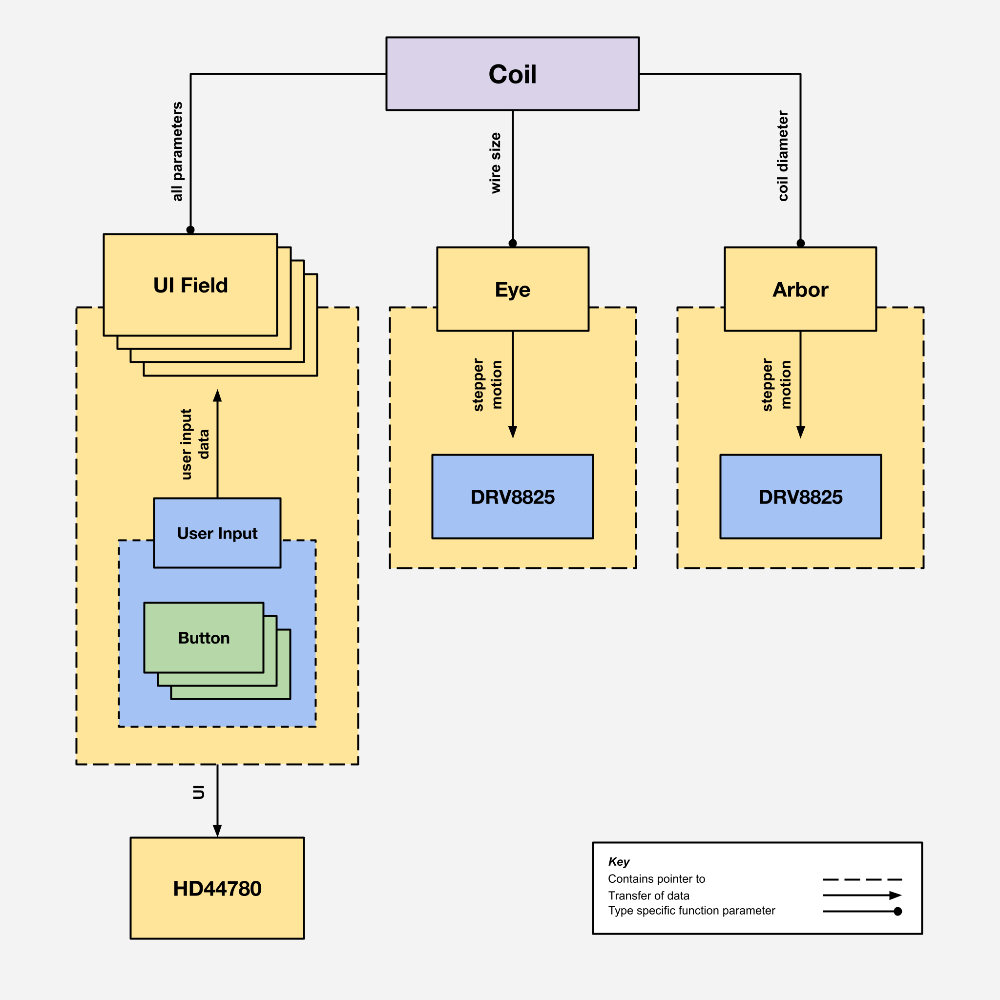

# Design Intent

This document is a high level overview of the design and structure of this project.

## Project Structure

This project intends to provide a simple and cost effective way to wind coils, using 3D printed and off the shelf components. It's maximum coil size of 30mm Lg x ⌀250mm makes this project well suited for sensing coils, charging coils, solenoids, and similar applications. At the highest possible level, this project is split into two mechanical assemblies, and one electrical assembly. These assemblies are described below:

- The Arbor is the form on which the coil is wound. It's driven by the *Arbor Motor Assembly*.
- The Eye sets the position of the wire relative to the arbor. It's driven by the *Eye Motor Assembly*.
- The *Driver Board* manages and controls the user interface, motors, and other peripherals.

## Mechanical Component Structure

The mechanical side of this project is built on a single part, 3D printed frame. By printing the frame as a single part, tight position tolerances can be met without the need for measuring and positioning components by hand. It also saves on assembly time. 

### Arbor Motor Assembly

The Arbor Motor Assembly is comprised mainly of a stepper motor with a 3:1 timing pulley gear reduction. This provides the necessary torque to maintain tension on the wire while the coil is wound. The Arbor itself is 3D printed and parametric, so that it may be scaled to accommodate a variety of coil sizes. It includes a wire retention screw to keep the wire tight wile the first coil is being wound, as well as coil tie off slots that allow the user to mechanically support the coil before it's removed from the Arbor.

### Eye Motor Assembly

The Eye Motor Assembly uses a 40:1 worm gear reduction to accurately position the eye relative to the Arbor. When the coil winding process starts, the Eye first finds an initial reference angle using a limit switch. It uses this reference angle alongside some computation to determine it's linear position from it's angular position. This method of extracting linear motion from angular motion was chosen since it provides very fine positional resolution and uses fewer parts then a traditional linear rail and lead screw system.

## Control Flow

This project is divided into two tasks (or "threads"), with control flow managed via FreeRTOS. The UI Task (which manages the User Interface) is of Normal OS priority. When the user begins the coil winding process, the UI Task Resumes the execution of the Motor Task. Since the Motor Task is of Above Average OS priority, it takes priority in execution, and only relinquishes control once the coil winder process concludes. This is done intentionally, as an extended interruption in execution may cause the arbor to lose tension on the wire being would, creating a defect in the coil. The UI and Motor Tasks are described below:

### UI Task

The UI task receives user input and updates the User Interface accordingly. The UI Task manages manages the followings sup-processes in the order described below.

#### Setup

1. Initializes the display where the UI is printed
2. Prints the user interface

#### Loop

1. Polls input from the user
2. Set's the position of the user's cursor
3. Updates the value (stored in memory) of the field the user is currently editing
4. Updates the value of the field displayed on the screen from the value stored in memory
5. Chooses to allows the Motor Task to begin execution.

### Motor Task

The Motor Task operates the coil winding process. The Motor Task manages manages the followings sub-processes in the order described below.

#### Setup
1. Initializes and enables stepper motor drivers
2. Suspends the Motor Task

#### Loop
1. Guides the user through the coil winding process through on screen prompts
2. Calculates the required steps to move the Eye at distances specified during the UI Task, and executes those steps. Calculates the required delay to move the Arbor at a consistent speed with respect to it's diameter, and executes those steps
3. Sleeps and disables the stepper motor drivers
4. Reminds the UI Task to redraw it's UI when the coil winding process has concluded
5. Suspends the Motor Task

## Code Structure

The two main tasks call a set of libraries that keep the data they manage organized and the code they run on dry. Each library defines an object that stores data about the component the library is meant to represent. These libraries and their interactions are described in the flow chart and object descriptions below:

- `CoilParameters_t` an object that stores the dimensions of the coil to be wound. It's corresponding library can be used to access and change these dimensions.
- `Button_t` an object that stores the GPIO interface and state of a button. This information is used in the Button object's corresponding library to support features like customizable press and hold behaviors, as well as normally open and normally closed switch types.
- `ArborParameters_t` an object that stores the Arbors surface speed and a pointer to it's corresponding . It's corresponding library can be used to rotate the Arbor, and set it's surface speed automatically based on the size of the coil being used.
- `DRV8825_Stepper_t` an object that stores GPIO information about a DRV8825_Stepper_t stepper driver chip. IIt's corresponding library provides low level control of most of the chips functions. 
- `EyeParameters_t` an object that stores the position, length, and DRV8825_Stepper_t for the Eye. It's corresponding library can be used to find it's home position or move the a predetermined distance 
- `UserInput_t` an object that can be used to retrieve user input as a single 32 bit value. It polls it's associated Button_t objects and aggregates their outputs into a single enumeration.
    - It's important to poll user input *only once per tick*. Otherwise, some statements executed in the same tick may see different user input values.
- `UIField_t` an object that stores the title and data accessor functions for a UI field. It's corresponding library can be used to print and update the UI field.

## Driver Board Component Choices

The Driver Board is a 4 layer PCB that serves to drive the display and stepper motors. The components utilized and justifications for their usage are described below.

- The ***STM32L432KCU6*** was chosen as this projects MCU for it's low cost, low power draw, and appropriate number of GPIO ports. 
- The ***DRV8825*** was chosen to drive this projects stepper motors for it's simple step and direction interface. It's current setting potentiometer also negates the need for a SPI current setting and interface, which saves on the number of required MCU GPIO ports.
- The ***AZ1117C*** was chose for LCD and MCU voltage regulation, as it comes preset at 5V and 3.3V levels, which lowers the number of supporting components required on the PCB.

All other components are standard/trivial supporting components chosen for easy hand-soldering assembly. All SMD resistors and capacitors are package size 0603 (Imperial).

## Current Issues

Though this project currently works as intended, some issues must be addresses before it is developed further:

- Motor task currently performs some limited display functions
    - Would require Motor Task to relinquish control during execution, and for more data to be shared between tasks
- GPIO ports won't Read/Write without first being driven from incorrect port on line 615.

## Planned Updates

In it's current state, this project is in the process of transitioning from working prototype and a first product iteration. In the future, I hope to:

- Transition to a 2 layer PCB, to save on cost
- Design an enclosure to house the display and driver electronics
- Transition to USB as the projects primary power source
